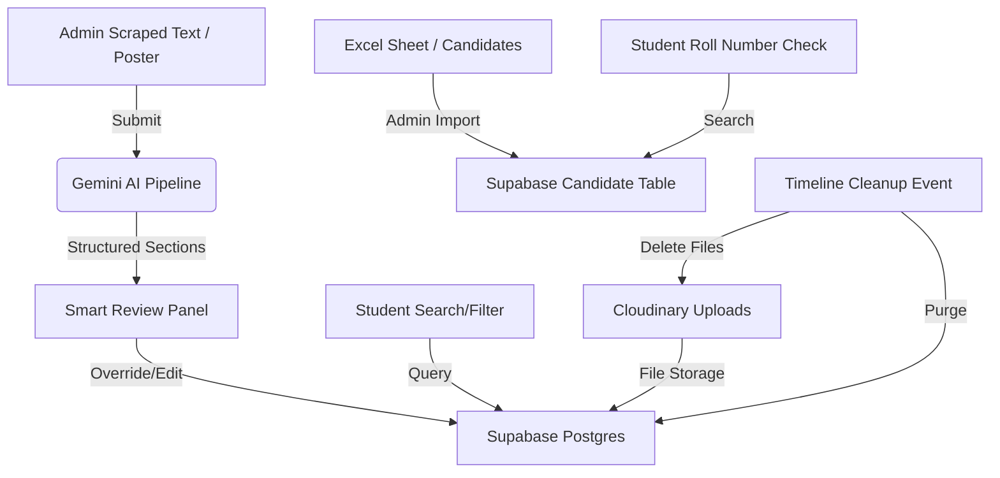

# Campus Opportunity Hub 🎓💼

Campus Opportunity Hub is an AI-powered, student-first unified platform designed to streamline campus placements, internship notices, hackathons, scholarships, and general academic updates. It transforms noisy, malformed, or OCR-scraped PDF circulars and posters into structured, instantly searchable, and interactive listings.

Live Website: [campusopportunityhub.in](https://campus-opportunity-hub-iota.vercel.app)

---

## 🎯 Project Overview

### 1. What It Does
*   **AI-Powered Notice Extraction**: Automatically parses unstructured, noisy notices (including scanned PDFs and images) using Gemini AI to extract roles, CTC, deadlines, criteria, interview rounds, and registration links.
*   **Structured Placement Cards & Tabs**: Displays opportunities using rich, auto-adaptive visual chips (eligibility batches, allowed backlogs, minimum CGPA, job location, work mode, and interview type).
*   **Direct Excel Eligibility Checker**: Allows students to input their Roll Number, Name, or Branch to instantly verify if they are on the college's pre-approved eligibility sheets uploaded by admins.
*   **Cloudinary Attachment Manager**: Supports uploading and downloading official PDF notices, registration guides, or candidate lists directly within listings.
*   **Mobile-First PWA Experience**: Features a standalone native app experience with floating navigation, safe-area-insets, and offline caching.
*   **Automatic Timeline Cleanup**: Periodically purges expired listings, associated eligibility rows, and corresponding Cloudinary files past their retention window (default 30 days) to keep database tables lightweight.

### 2. Why It Does It (The Problem)
*   **Noisy Information Channels**: Placement cells often post critical hiring notices as scanned PDFs, images on WhatsApp, or wall posters, which makes searching or copy-pasting information frustrating.
*   **Manual Eligibility Verification**: Students waste time checking detailed eligibility criteria sheets. Campus Opportunity Hub automates this by providing instant self-service roll number checks.
*   **Fragmented Storage**: PDFs, lists, and links get scattered across email threads and portals. This platform organizes documents directly alongside their respective opportunities.
*   **Outdated Databases**: Expired listings clog dashboards. The timeline cleanup mechanism automatically purges expired records to maintain database efficiency.

### 3. How It Works (System Architecture)

*   **Data Flow**: Paste raw notice text → Gemini extracts a 100+ field JSON object → Review in Smart View -> Edit using dynamic modal → Save to Supabase -> Attach documents to Cloudinary.
*   **Rate Limiting & Speed**: Leverages Upstash Redis to cache scrapper endpoints and rate limit public API endpoints (applying strict limits for student activities and API access).

---

## 🛠️ Tech Stack

*   **Framework**: Next.js 14 (App Router)
*   **Database**: Supabase (PostgreSQL with RLS policies, custom indexes, FTS)
*   **AI Extraction**: Google Gemini (gemini-2.0-flash / gemini-1.5-flash)
*   **File Storage**: Cloudinary (for documents, PDFs, Excel sheets)
*   **Caching & Security**: Upstash Redis (caching and API rate limiting)
*   **Styling**: Tailwind CSS & Framer Motion (for smooth premium animations)
*   **Libraries**: `xlsx` (sheet parsing), `pdfjs-dist` & `tesseract.js` (OCR), `lucide-react` (iconography)

---

## 🚀 Installation & Local Setup

### 1. Clone & Install
```bash
git clone https://github.com/rahul11f/campus-opportunity-hub.git
cd campus-opportunity-hub
npm install
```

### 2. Configure Environment Variables
Create a `.env.local` file in the root directory and configure the following variables:
```env
# Supabase Keys
NEXT_PUBLIC_SUPABASE_URL=https://your-project.supabase.co
NEXT_PUBLIC_SUPABASE_ANON_KEY=your_anon_key
SUPABASE_SERVICE_ROLE_KEY=your_service_role_key

# Google Gemini API
GEMINI_API_KEY=your_gemini_api_key

# Upstash Redis (Leave blank to disable in dev)
UPSTASH_REDIS_REST_URL=your_redis_url
UPSTASH_REDIS_REST_TOKEN=your_redis_token

# Cloudinary Integration
CLOUDINARY_CLOUD_NAME=your_cloud_name
CLOUDINARY_API_KEY=your_api_key
CLOUDINARY_API_SECRET=your_api_secret

# Whitelisted Admins (Comma-separated)
ADMIN_EMAIL_WHITELIST=admin@example.com
```

### 3. Apply Database Patches
Run the following SQL patches in your Supabase SQL editor:
*   [schema.sql](file:///b:/Desktop/campus-opportunity-hub/campus-opportunity-hub/supabase/schema.sql) (Core opportunities and logs)
*   [phase2-foundation.sql](file:///b:/Desktop/campus-opportunity-hub/campus-opportunity-hub/supabase/phase2-foundation.sql) (Colleges, Modules, and Candidates tables)
*   [student-feature-patch.sql](file:///b:/Desktop/campus-opportunity-hub/campus-opportunity-hub/supabase/student-feature-patch.sql) (Saved lists, notifications, applications)
*   [phase3-attachments-cleanup-patch.sql](file:///b:/Desktop/campus-opportunity-hub/campus-opportunity-hub/supabase/phase3-attachments-cleanup-patch.sql) (Cloudinary attachments column & purge functions)

### 4. Run Development Server
```bash
npm run dev
```
Open [http://localhost:3000](http://localhost:3000) to view the application.

---

## 🔒 Security & Optimization
*   **Row-Level Security (RLS)**: Users can only query their own application details, saved items, and notifications. Service role handles administrative uploads.
*   **Static Page Optimization**: Heavy components (e.g. navigation loader, command menus) are encapsulated in `<Suspense>` boundaries to ensure server-side rendering routes compile cleanly.
